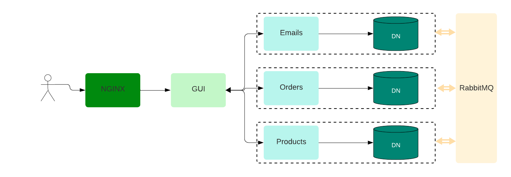

# Django Microservices E-commerce Backend

This project implements a microservices architecture for an e-commerce application using Django. The backend consists of four Django microservices — **Auth**, **Emails**, **Orders**, and **Products** — each with its own dedicated database. RabbitMQ facilitates asynchronous communication between services. The frontend is built in React, and NGINX acts as a reverse proxy.

## Project Structure

```
├── frontend
│   ├── public
│   └── src
│       └── components
├── images
└── services
    ├── auth_service
    │   ├── api
    │   │   └── management
    │   └── auth_service
    ├── emails
    │   ├── api
    │   │   ├── management
    │   │   └── migrations
    │   ├── common
    │   │   └── utils
    │   ├── emails
    │   └── microservices
    ├── orders
    │   ├── api
    │   │   ├── migrations
    │   │   └── views
    │   ├── microservices
    │   └── orders
    └── products
        ├── api
        │   ├── management
        │   └── migrations
        ├── microservices
        └── products
```

### Architecture Diagram



## Microservices

| Service | Port | Responsibility |
|---|---|---|
| `auth_service` | 8000 | Authentication, JWT issuance, user management |
| `emails` | 8001 | Email dispatch and notification handling |
| `orders` | 8002 | Order processing and fulfilment |
| `products` | 8003 | Product catalogue and inventory |

## Databases

Each microservice connects to its own dedicated PostgreSQL database, ensuring full data isolation between services. Database connection strings are injected at deploy time via environment variables (`DATABASE_URL`).

## Communication via RabbitMQ

Microservices communicate asynchronously through RabbitMQ as a message broker. Events such as order placement, product inventory updates, and email notifications are exchanged between services, keeping the architecture decoupled and resilient.

## Backend Technologies

- **Django** — high-level Python web framework powering each microservice
- **Django REST Framework** — RESTful API layer for each service
- **Gunicorn** — WSGI server running each Django app in production
- **RabbitMQ** — asynchronous message broker for inter-service events
- **PostgreSQL** — dedicated relational database per microservice

## NGINX Reverse Proxy

NGINX sits in front of all services and handles:

- Path-based routing to the correct microservice
- SSL termination
- Load balancing
- CORS headers
- Rate limiting
- Request/response logging

Each microservice exposes a `/health/` endpoint used by NGINX and the load balancer for upstream health checks.

## Infrastructure (Terraform)

The `infra/` directory contains Terraform configuration to deploy the full stack to AWS:

- **VPC** with public and private subnets across two availability zones
- **EC2 instances** — one per microservice (private subnets) + one for the frontend (public subnet)
- **Application Load Balancer** with path-based listener rules
- **RDS PostgreSQL 15** in private subnets with encryption at rest
- **NAT Gateway** allowing private instances to reach the internet for updates

```bash
cd infra
cp terraform.tfvars.example terraform.tfvars   # fill in secrets
terraform init
terraform plan
terraform apply
```

## Docker Compose (Local Development)

The full application stack can be run locally with Docker Compose:

```bash
git clone https://github.com/mohammed78620/microcommerce-platform.git
cd microcommerce-platform
docker-compose -f docker-compose.dev.yaml up
```

| URL | Service |
|---|---|
| [http://localhost:80](http://localhost:80) | React frontend |
| [http://localhost:15672](http://localhost:15672) | RabbitMQ Management UI (`guest` / `guest`) |
| [http://localhost:8000](http://localhost:8000) | auth_service (direct) |
| [http://localhost:8001](http://localhost:8001) | emails (direct) |
| [http://localhost:8002](http://localhost:8002) | orders (direct) |
| [http://localhost:8003](http://localhost:8003) | products (direct) |

## Testing CI Locally

To run GitHub Actions workflows locally without pushing to GitHub, use [**act**](https://github.com/nektos/act):

```bash
# Install act (macOS)
brew install act

# Install act (Linux)
curl -s https://raw.githubusercontent.com/nektos/act/master/install.sh | bash

# List available workflows
act -l

# Run the default push event
act push

# Run a specific job
act -j test

# Run with secrets
act push --secret-file .secrets
```

`act` uses Docker to simulate the GitHub Actions runner environment, so your workflows execute exactly as they would in CI before you push. See the [act documentation](https://github.com/nektos/act) for advanced usage including matrix builds and custom runner images.

## Environment Variables

Each service reads its configuration from environment variables. Copy `.env.example` to `.env` in each service directory:

| Variable | Description |
|---|---|
| `DJANGO_SECRET_KEY` | Django secret key |
| `DATABASE_URL` | Postgres connection string |
| `RABBITMQ_URL` | RabbitMQ connection string |
| `DJANGO_DEBUG` | `True` for local dev, `False` in production |
| `DJANGO_ALLOWED_HOSTS` | Comma-separated list of allowed hosts |

## License

This project is licensed under the [MIT License](LICENSE).
